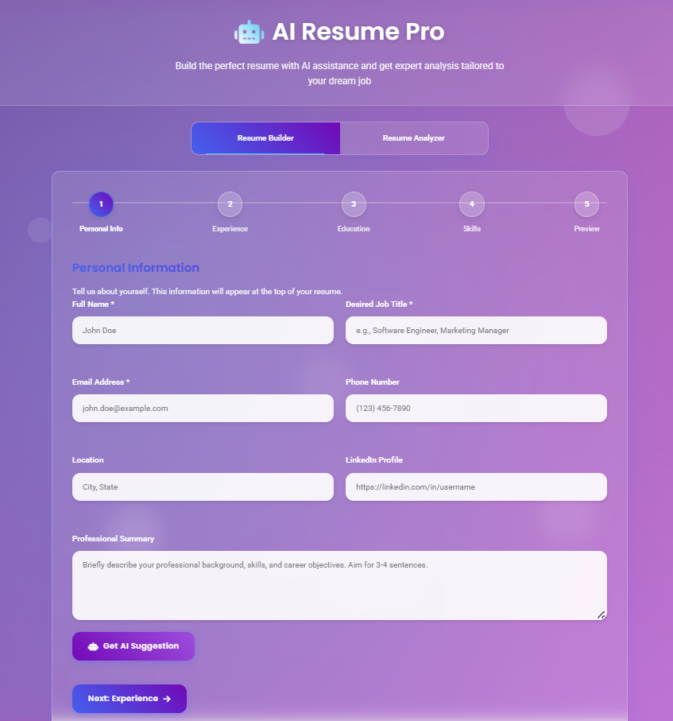
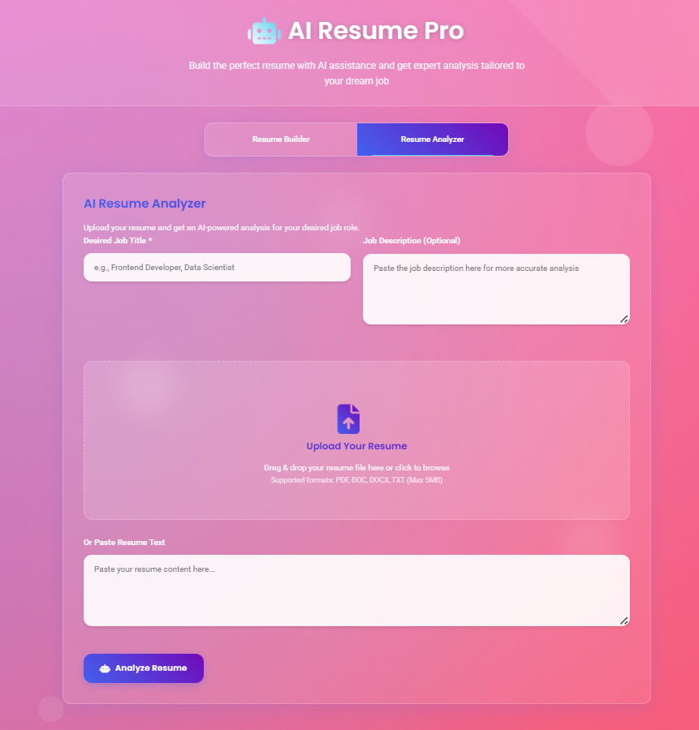

<div align="center">

# 🤖 AI Resume Pro  
### ✨ AI-Powered Resume Builder & Smart Resume Analyzer

Build stunning resumes and analyze them with AI to match your dream job 💼🚀


</div>

---

## 🌟 Project Overview

**AI Resume Pro** is a modern, glass-morphism styled web application that helps users:

- 🧠 **Build professional resumes step-by-step**
- 📊 **Analyze resumes using AI**
- 🎯 **Match resumes with job roles**
- 📥 **Download resumes as PDF**
- ⚡ **Get instant AI suggestions**

Designed for **students, job seekers, and professionals**.

---
## 📸 Screenshots




---

## 🖥️ Live Features

### 📝 Resume Builder
✔ Personal Info  
✔ Experience & Education  
✔ Skills & Certifications  
✔ AI-Generated Content  
✔ Resume Preview  
✔ PDF Download  

### 🔍 Resume Analyzer
✔ Upload PDF / DOC / DOCX / TXT  
✔ Extract resume text automatically  
✔ AI resume scoring (0–100)  
✔ Strengths & improvement suggestions  
✔ AI-generated professional summary  

---

## 🎨 UI Highlights

- 🌈 Animated gradient background  
- 🧊 Glassmorphism cards  
- 🧭 Step-by-step wizard  
- ⚡ Smooth transitions & micro-animations  
- 📱 Fully responsive design  

---

## 🛠️ Tech Stack

| Technology | Usage |
|----------|------|
| **HTML5** | Structure |
| **CSS3** | Glassmorphism UI & Animations |
| **JavaScript** | Logic & Interactions |
| **Gemini 2.5 Flash API** | AI Resume Analysis |
| **PDF.js** | PDF Text Extraction |
| **Mammoth.js** | DOCX Parsing |
| **html2pdf.js** | Resume PDF Export |
| **Font Awesome** | Icons |

---


---

## 🔐 API Configuration

Replace your Gemini API key in `index.html`:

```js
const API_KEY = "YOUR_GEMINI_API_KEY";

```
---

## 🚀 Future Enhancements

🔑 Authentication (Login / Signup)

🧾 Multiple resume templates

🤝 LinkedIn profile import

📈 ATS compatibility checker

☁ Cloud resume storage

🧠 OpenAI / Multi-AI support

---

## 🎯 Ideal For

Students 👨‍🎓

Freshers 🆕

Job Seekers 💼

Hackathon Projects 🏆

---

## 🤝 Contributing

Contributions are welcome!

Fork the repo 🍴

Create a new branch 🌿

Commit your changes 💾

Open a Pull Request 🔁

---

## 👨‍💻 Author

**Abdullah R**
- 🚀 AI & Full-Stack Development Enthusiast  
- 🔗 Let’s connect and build something amazing!

- 💡 Passionate about building smart, scalable, and user-friendly applications  
- 🌱 Always learning | Always building
